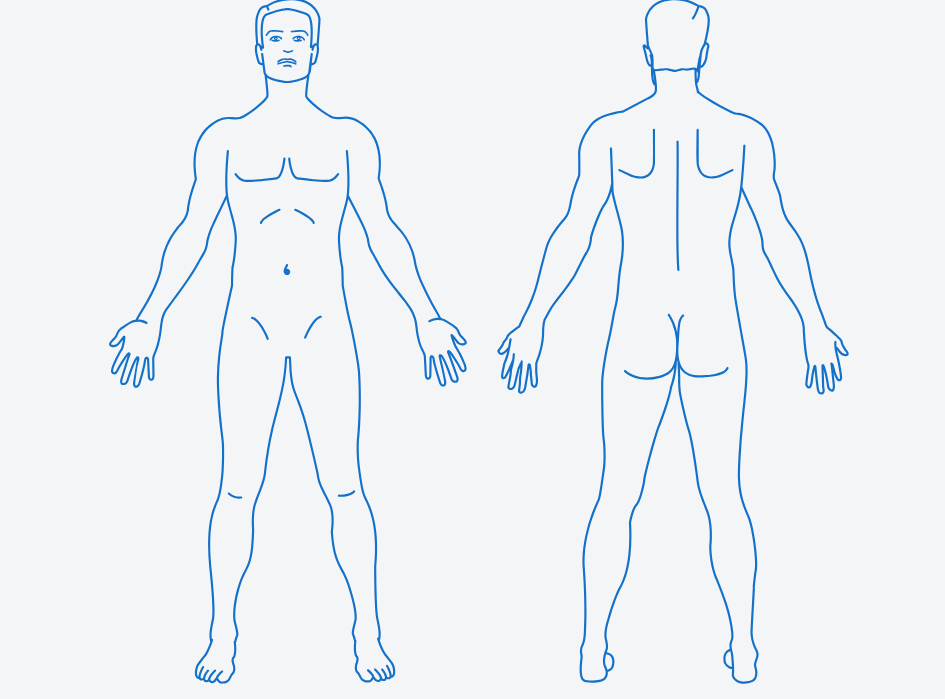

# react-body-medic

## 🚀 Instalación

npm install react-body-medic
# o pnpm
pnpm add react-body-medic
# o yarn
yarn add react-body-medic

## 📦 Uso básico

import { useState } from "react";
import { HumanBody } from "react-body-medic";

export default function App() {
  const [selected, setSelected] = useState("");

  return (
    

      <h1>Parte seleccionada: {selected}</h1>
      <HumanBody onSelect={setSelected} />
    

  );
}

## Ej. del human body

